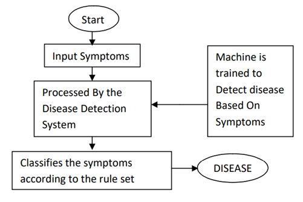

# Disease_Detection_System

## Problem_Statement:
The detection system has been developed using Random Forest algorithm. The algorithm takes into consideration training set and based on it teaches the machine to identify disease based on symptoms. Once the disease is detected we search for corresponding remedy for the disease. 

## Dataset Used:
>[Disease_dataset](https://www.kaggle.com/datasets/itachi9604/disease-symptom-description-dataset)

## Alogrithm Used:
Random-Forest Classifier

##
